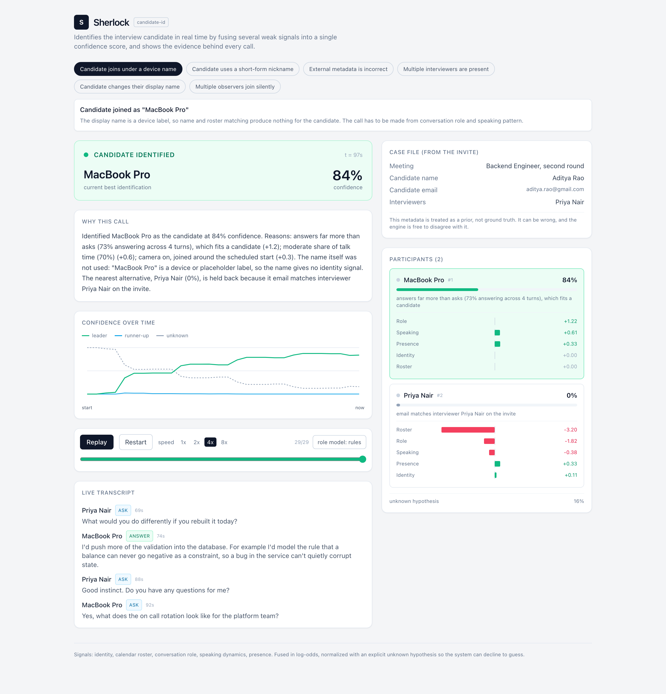
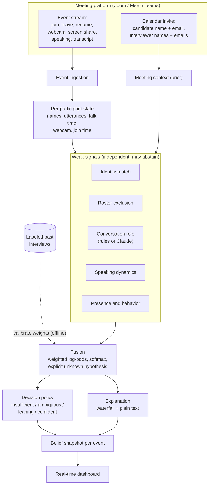
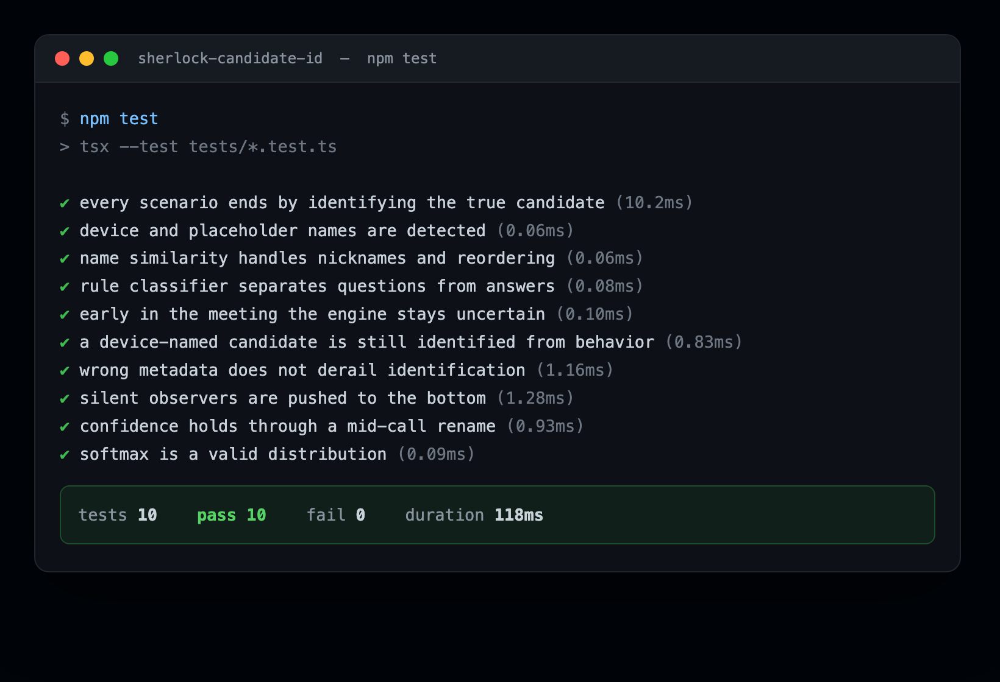

# Sherlock: real-time interview candidate identification

**Live demo: https://sherlock-red.vercel.app** &nbsp;|&nbsp; video: https://youtu.be/ufgw7XfF8HM 

Sherlock's fraud detectors (deepfake, voice cloning, behavioral analysis) have to
analyze the candidate's audio and video, not the interviewer's or an observer's.
So first they need to know which participant is the candidate. That is harder than
it sounds: candidates join as "MacBook Pro", use nicknames, get entered under the
wrong name, rename themselves mid-call, and share the room with panels of
interviewers and silent observers.

This project identifies the candidate in real time by fusing several weak signals
into one confidence score, and it explains every decision. It never relies on a
single rule, and it declines to guess when the evidence is thin.

<p align="center">
  
</p>

## The idea in one paragraph

Each participant is a hypothesis: "this person is the candidate." Five independent
signals each vote with a log-odds weight. An identity signal reads the display
name, a roster signal cross-references the calendar invite, a conversation-role
signal decides whether someone is asking or answering, a speaking-dynamics signal
looks at talk time, and a presence signal reads webcam and join time. The votes
are summed and passed through a softmax that also includes an explicit "unknown"
hypothesis, so the output is a real probability distribution. A policy then decides
whether to stay quiet, flag ambiguity, lean, or commit. Because the score is a sum
of signal contributions, the explanation is exact.

## Architecture



Why this shape:

- **Weak signals over one rule.** No single cue is reliable. Names can be devices
  or nicknames, metadata can be wrong, cameras can be off. Each signal is allowed
  to be weak and to abstain; the fusion step combines them.
- **Log-odds fusion.** Each signal returns a signed contribution in nats. Adding
  them is the Bayesian way to combine independent evidence, and because the total
  is a sum, the waterfall the UI shows adds up to the score exactly.
- **An explicit unknown hypothesis.** The softmax runs over the participants plus a
  constant "unknown" class. When nothing is discriminating, that class holds most
  of the mass and the system reports "gathering evidence" instead of guessing.
- **Streaming by construction.** The engine is a pure function of accumulated
  state. It emits a fresh belief after every event, so the same code runs over a
  live socket in production or a replayed scenario in the demo.

More detail in [docs/architecture.md](docs/architecture.md).

## The five signals

| Signal | Reads | Contribution |
| --- | --- | --- |
| Identity match | display name vs candidate name and email | positive when the name matches; abstains for device or placeholder names |
| Roster exclusion | participant email or name vs the invite | strong positive for a verified candidate email, strong negative for a known interviewer |
| Conversation role | speaker-attributed transcript | positive for answering, negative for asking; the most naming-robust signal |
| Speaking dynamics | talk-time share, turn length | positive for holding the floor, strong negative for sustained silence |
| Presence and behavior | webcam, join time, screen share | weak cues that only matter in aggregate |

## Fusion and decision

For participant `p`, the score is `S(p) = sum over signals of weight_s *
contribution_s(p)`. The posterior is `softmax([S(p1), ..., S(pn),
UNKNOWN_FLOOR])`, whose last element is the unknown mass. The decision policy reads
the top probability, the margin to the runner-up, and the unknown mass:

- `confident` when the leader is high and well separated
- `leaning` when there is a clear but not yet trustworthy front-runner
- `ambiguous` when the top two are close, so the system holds and does not pick
- `insufficient` when unknown dominates or nothing stands out

## What it handles

Each of these is a built-in scenario you can replay in the UI, mapped one to one to
the failure cases in the brief:

| Challenge from the brief | Scenario | What carries the decision |
| --- | --- | --- |
| Candidate joins as a device name | `macbook-pro` | conversation role and speaking pattern |
| Candidate uses a nickname | `nickname` | partial name match plus behavior |
| Interviewer entered the wrong name | `wrong-name` | metadata is ignored, roster and behavior win |
| Multiple interviewers | `multi-interviewer` | roster exclusion and single answerer |
| Candidate renames mid-interview | `name-change` | behavior holds the decision steady |
| Silent observers | `silent-observers` | sustained silence rules them out |

## Quick start

Requirements: Node 18 or newer.

```bash
npm install
npm run dev
# open http://localhost:3000
```

The app runs fully offline. No API keys are needed.

Other commands:

```bash
npm test           # unit and scenario tests (10 tests)
npm run replay             # evaluate every scenario in the terminal
npm run replay macbook-pro # print the full belief timeline for one scenario
npm run calibrate          # fit signal weights from the labeled scenarios
npm run build              # production build
```

## Optional: upgrade the transcript classifier to Claude

The conversation-role signal ships with a deterministic rule classifier, so the
demo is reproducible and needs no network. If you provide an Anthropic key, the
"role model" toggle in the UI switches utterance labeling to Claude (Haiku). This
is entirely optional. With no key the toggle stays on the rule classifier and the
app tells you so.

```bash
cp .env.example .env.local
# set ANTHROPIC_API_KEY in .env.local
```

## How the demo works

Meeting event streams are simulated. The brief says to assume the system has access
to participant, audio, video, transcript, and calendar data, so each scenario is a
scripted stream of exactly those events with a known true candidate for scoring.
The engine in `src/engine` is a pure module: feed it events, get back a belief
snapshot after each one. In the demo that engine runs in the browser and replays a
scenario on a timer. In production the same code would run behind the
meeting-platform webhooks. Nothing about the engine changes between the two.

The dashboard shows, live: the current decision and confidence, a per-participant
evidence waterfall, confidence over time (including the runner-up and the unknown
mass), the speaker-attributed transcript with ask or answer labels, and a
plain-language explanation of the current call.

## Evaluation

10 of 10 tests pass and all 6 scenarios identify the true candidate.

<p align="center">
  
</p>

| Scenario | Decision | Leader confidence | What made it hard |
| --- | --- | --- | --- |
| `macbook-pro` | confident | 84% | display name carries no identity |
| `nickname` | confident | 98% | name only partially matches |
| `wrong-name` | confident | 86% | invite names the wrong person |
| `multi-interviewer` | confident | 99% | three interviewers, one candidate |
| `name-change` | confident | 98% | candidate renames mid-call |
| `silent-observers` | confident | 97% | two non-speaking participants |

Calibration lifts the mean log-likelihood of the true candidate from -0.104 to
-0.024 while holding accuracy at 100%, and it independently rediscovers that the
behavioral signals deserve the most weight. Full method, edge cases, accuracy, and
limitations in [docs/EVALUATION.md](docs/EVALUATION.md).

## Trade-offs and limitations

- The demo simulates the meeting streams rather than integrating with Zoom, Meet,
  and Teams, because real integrations are out of scope for a prototype. The engine
  is written so those events could come from a real webhook unchanged.
- The strongest possible signals, a consistent voiceprint and face across the call,
  are not implemented yet. The signal interface is designed to take them.
- The deterministic classifier keys on English question and answer cues. The Claude
  option removes that assumption; the rest of the engine is language agnostic.
- Thresholds and default weights are reasonable but fit to six scenarios. Real
  calibration needs a labeled corpus, which `calibrate.ts` is the path to.

## Project structure

```
src/
  engine/
    engine.ts          stream processor: events in, belief snapshots out
    fusion.ts          weighted log-odds -> softmax with an unknown hypothesis
    decision.ts        insufficient / ambiguous / leaning / confident
    explain.ts         deterministic natural-language rationale
    signals/           the five weak signals
    util/              string similarity and math helpers
  scenarios/           six labeled scenarios, one per edge case
  lib/                 replay hook, timeline, LLM client helper
  components/          dashboard UI
  app/                 Next.js app and the /api/classify route
scripts/
  replay.ts            CLI evaluation and timeline printing
  calibrate.ts         offline weight fitting from labeled interviews
tests/
  engine.test.ts       unit and end-to-end scenario tests
docs/
  architecture.md      diagram and design notes
  EVALUATION.md        testing, edge cases, accuracy, limitations
  DEMO_SCRIPT.md       walkthrough for the demo video
```

## Assumptions

- The system has access to the event and metadata streams listed in the brief.
  Real integrations are out of scope, so those streams are simulated with scripted
  scenarios.
- Exactly one candidate is expected per interview, but the model does not require
  the candidate to be present. If no one looks like the candidate, the unknown
  hypothesis wins and the system says so.
- Calendar metadata is a prior, not ground truth. It can be missing, misspelled, or
  wrong, and the engine is free to disagree with it.
- Weights are hand-set defaults. `npm run calibrate` shows how they would be refit
  from labeled interviews as more data arrives.

## What I would improve next

- Add real audio and face embeddings as two more signals, so the decision keeps a
  single voice and face consistent across a call even through renames.
- Learn calibrated weights and thresholds from a real labeled corpus, and report a
  calibration curve rather than a single accuracy number.
- Handle harder cases: two people sharing one tile, a candidate who barely speaks,
  and interviews with more than one person answering.
- Persist beliefs and stream them to the fraud detectors so they attach to the
  candidate's audio and video track automatically.
