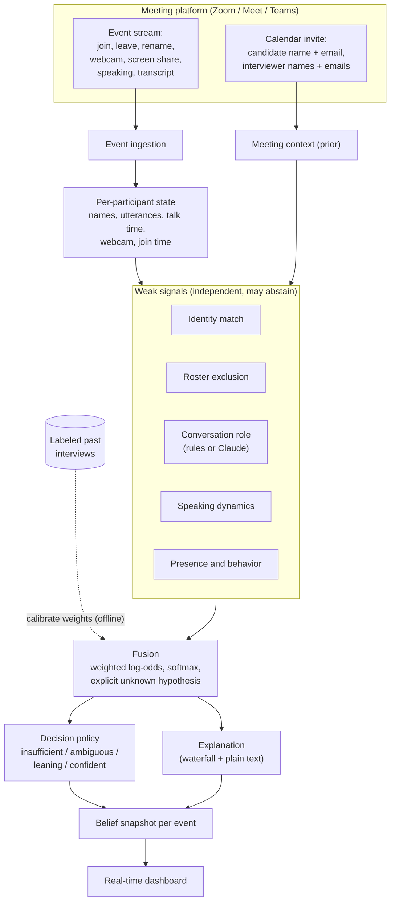

# Architecture

Sherlock treats candidate identification as reasoning under uncertainty, not
string matching. Every participant is a hypothesis ("this person is the
candidate"). Several independent signals each vote with a log-odds weight, the
votes are fused into a probability distribution, and a policy decides whether the
evidence is strong enough to act on.

## Data flow

## Why this shape

- **Weak signals over one rule.** No single cue is reliable. Names can be
  devices or nicknames, metadata can be wrong, cameras can be off. Each signal is
  allowed to be weak and to abstain, and the fusion step combines them.
- **Log-odds fusion.** Each signal returns a signed contribution in nats. Adding
  them is the Bayesian way to combine independent evidence, and because the total
  is a sum, the explanation is exact: the waterfall the UI shows adds up to the
  score.
- **An explicit unknown hypothesis.** The softmax runs over the participants plus
  a constant "unknown" class. When nothing is discriminating, that class holds
  most of the mass and the system reports "gathering evidence" instead of
  guessing.
- **Streaming by construction.** The engine is a pure function of accumulated
  state. It emits a fresh belief after every event, so it runs the same way over
  a live socket in production or a replayed scenario in the demo.

## Signals

| Signal | Reads | Contribution |
| --- | --- | --- |
| Identity match | display name vs candidate name and email | positive when the name matches; abstains for device or placeholder names |
| Roster exclusion | participant email or name vs the invite | strong positive for a verified candidate email, strong negative for a known interviewer |
| Conversation role | speaker-attributed transcript | positive for answering, negative for asking; the most naming-robust signal |
| Speaking dynamics | talk-time share, turn length | positive for holding the floor, strong negative for sustained silence |
| Presence and behavior | webcam, join time, screen share | weak cues that only matter in aggregate |

## Fusion and decision

For participant `p`, the score is `S(p) = sum over signals of weight_s *
contribution_s(p)`. The posterior is `softmax([S(p1), ..., S(pn), UNKNOWN_FLOOR])`,
whose last element is the unknown mass.

The decision policy reads the top probability `p1`, the margin to the runner-up,
and the unknown mass:

- `confident` when `p1 >= 0.70`, margin `>= 0.20`, and unknown `< 0.45`
- `leaning` when there is a clear but not yet trustworthy front-runner
- `ambiguous` when the top two are close, so the system holds and does not pick
- `insufficient` when unknown dominates or nothing stands out

## Production vs demo

The same engine module (`src/engine`) runs in both settings. In the demo it runs
in the browser over scripted scenarios so anyone can open the page and watch it
work. In production the identical code would sit behind the meeting platform
webhooks, consume real events, and stream belief snapshots to the fraud
detectors so they analyze the right audio and video streams.
